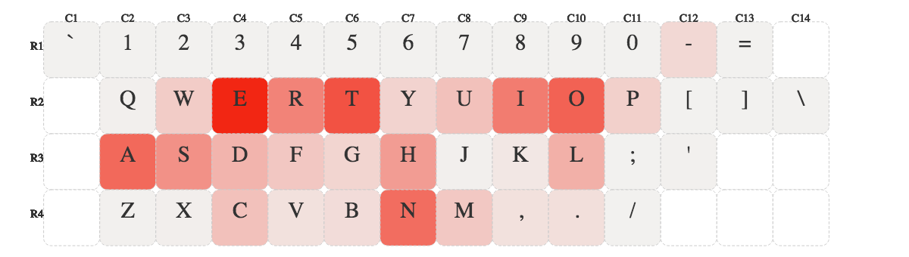

## kbvis | キーボードヴィズ

---
# 動機
### キーボードは個人で組み立てる時代
### 最&高のレイアウトが知りたい

---
## 注目したデータ
### => テキスト

---
# 可視化する意味
### [ 文字数 = 打鍵量 ]→ 打ちやすさの指標

---
## 使用データ...有名なサンプルを手動で用意

---
# 手順
### JSON読込→テキスト比較→正規化→描画

---
# 結果

---
# わかったこと
母音(AOEUI)はたくさん押される

---
# 左手が右手より、若干忙しい傾向

---
# 可視化合宿までにやること
- サンプルの抽出方法に意味を持たせる |
- レイアウトを変更可能に |
- ASCII以外のデータ入力に対応 |

---
# 以上です♨️
